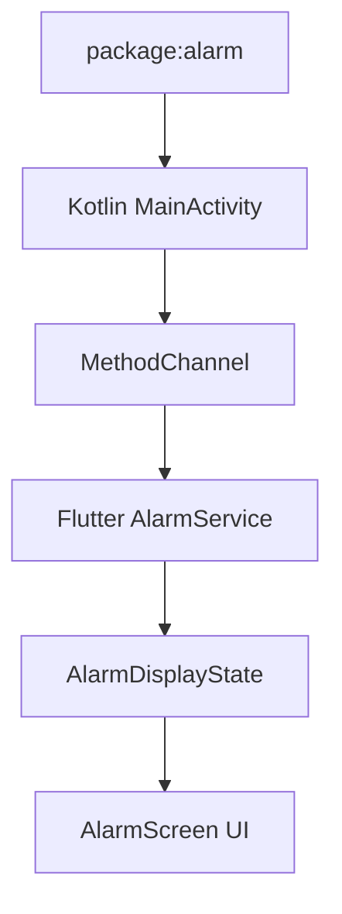

# TaskNotate

<p align="center">
  
</p>

<p align="center">
  <em>Your ultimate productivity companion with beautiful theme customization</em>
</p>

<div align="center">

[](https://flutter.dev)
[](https://dart.dev)
[](https://pub.dev/packages/get)
[](https://www.sqlite.org/index.html)
[](https://en.wikipedia.org/wiki/Model%E2%80%93view%E2%80%93controller)
[](https://kotlinlang.org)
[](https://firebase.google.com/docs/cloud-messaging)
[](https://blog.cleancoder.com/uncle-bob/2012/08/13/the-clean-architecture.html)
[](https://gist.github.com/wojteklu/73c6914cc446146b8b533c0988cf8d29)

</div>

---

## Theme Showcase

### Default Theme
<p align="center">
  
  
  
  
</p>

### Additional Screenshots
<p align="center">
  
  
  
  
  
  
  
  
</p>

---

## Core Features

### General Features
- 20+ Color Themes with one-tap switching
- Dark/Light Mode based on system or manual toggle
- Simple & Fast Task Management
- Multi-language: English, العربية, Español, Deutsch, 中文

### Advanced Task Management
- Reminders & Deadlines with notifications
- Nested Subtasks
- Smart Sorting (date, priority, etc.)
- Timeline View

### Elegant Note-Taking
- Canvas Drawing
- Auto-saving
- Minimal Interface

---

## Technology Stack

| Component        | Technology                    |
|------------------|-------------------------------|
| Framework        | Flutter 3.x                   |
| Architecture     | MVC + Clean Architecture      |
| State Management | GetX                          |
| Local Database   | SQLite                        |
| Notifications    | Firebase Cloud Messaging      |
| Native Features  | Kotlin for Android            |
| Drawing          | Custom Canvas                 |
| Code Quality     | Clean Code Principles         |
| Alarm System     | `package:alarm` 4.1.1         |

---

## Alarm System Implementation

### Technical Overview

TaskNotate’s alarm system leverages `package:alarm 4.1.1` combined with native Android integration for reliable alarm functionality.



### Key Requirements
- Wake device screen when alarm triggers  
- Display over lock screen  
- Work in all app states (foreground/background/terminated)  
- Survive device reboots  

### Workflow Breakdown

#### Native Layer (Kotlin)

```kotlin
override fun onCreate(savedInstanceState: Bundle?) {
    if (intent?.action == "com.megoabkm.tasknotate.ALARM_TRIGGER") {
        if (Build.VERSION.SDK_INT >= Build.VERSION_CODES.O_MR1) {
            setShowWhenLocked(true)
            setTurnScreenOn(true)
        } else {
            window.addFlags(
                WindowManager.LayoutParams.FLAG_KEEP_SCREEN_ON or
                WindowManager.LayoutParams.FLAG_TURN_SCREEN_ON or
                WindowManager.LayoutParams.FLAG_SHOW_WHEN_LOCKED
            )
        }
    }
    super.onCreate(savedInstanceState)
}
```

#### Flutter-Dart Layer

```dart
void _handleAlarmTrigger(AlarmSettings settings) async {
  await AlarmDisplayStateService.to.setAlarmScreenActive(true);
  Get.offAllNamed(AppRoute.alarmScreen, arguments: {
    'id': settings.id,
    'title': 'Task Reminder'
  });
}
```

#### Stopping Alarms

```dart
await Alarm.stop(alarmId);
await AlarmDisplayStateService.to.setAlarmScreenActive(false);
```

#### State Persistence
- Uses SharedPreferences to store alarm state
- Ensures consistency across app restarts

---

## Get Started in 3 Steps

```bash
# 1. Clone the repository
git clone https://github.com/MegoABKM/TaskNotate.git

# 2. Navigate to project
cd TaskNotate

# 3. Run the app
flutter pub get && flutter run
```

<div align="center">
  
  
</div>
