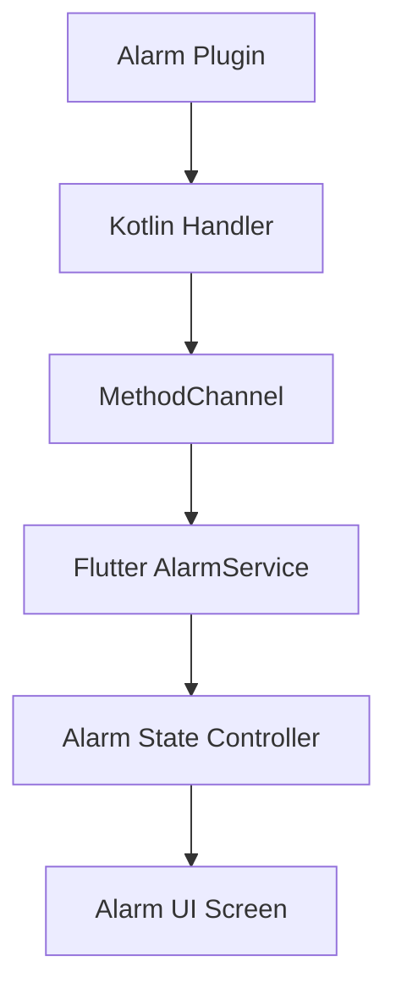

# 🚀 TaskNotate

<p align="center">
  
</p>

<p align="center"><em>Your ultimate productivity companion with beautiful theme customization and powerful task reminders ⏰📝</em></p>

<div align="center">


</div>

---

## 🎨 Theme Showcase

### 🌈 Default Theme
<p align="center">
  
  
  
  
</p>

### 📱 Additional Screens
<p align="center">
  
  
  
  
  
  
  
  
</p>

---

## ✨ Features

### ✅ Task Management
- 📝 Create, edit, and delete tasks with ease
- 🗂 Sort by due date, priority, or title
- 📆 Timeline View & Calendar Integration

### 🔔 Local Notifications
- Uses `flutter_local_notifications`
- ⏰ Schedule alarms that trigger at exact time
- 🔒 Works in background & locked screen
- 💤 Persistent alarm screen until dismissed

### 🎨 Themes & UI
- 🎨 20+ Color Themes (switch anytime)
- 🌙 System-based Light/Dark mode
- 🌐 Supports English, العربية, Español, Deutsch, 中文

### 🖌️ Notes & Drawing
- ✍️ Handwritten notes via canvas
- 📁 Auto-save notes locally
- 🧼 Clean, minimal layout

---

## 🧱 Tech Stack

| 🔧 Component        | 🚀 Technology                   |
|---------------------|-------------------------------|
| Framework           | Flutter 3.x                   |
| Architecture        | Clean + MVC                   |
| State Management    | GetX                          |
| Local DB            | SQLite                        |
| Alarm Scheduling    | `package:alarm` + LocalNotif  |
| Platform Integration| Kotlin                        |
| Drawing Engine      | Flutter CustomPaint           |

---

## 🔔 Alarm System Overview

TaskNotate integrates precise local alarms with custom native Android UI for a seamless reminder experience.



### 📌 Features
- 🔓 Wake device + show over lockscreen
- 🔄 Reliable after reboots
- 🔕 Manual and auto-dismiss
- 📡 Built with `flutter_local_notifications`

---

## 🧩 Sample Code

### 📱 Native Android (Kotlin)

```kotlin
override fun onCreate(savedInstanceState: Bundle?) {
    if (intent?.action == "com.megoabkm.tasknotate.ALARM_TRIGGER") {
        if (Build.VERSION.SDK_INT >= Build.VERSION_CODES.O_MR1) {
            setShowWhenLocked(true)
            setTurnScreenOn(true)
        } else {
            window.addFlags(
                WindowManager.LayoutParams.FLAG_KEEP_SCREEN_ON or
                WindowManager.LayoutParams.FLAG_TURN_SCREEN_ON or
                WindowManager.LayoutParams.FLAG_SHOW_WHEN_LOCKED
            )
        }
    }
    super.onCreate(savedInstanceState)
}
```

### 🔁 Flutter Integration

```dart
void _handleAlarmTrigger(AlarmSettings settings) async {
  await AlarmDisplayStateService.to.setAlarmScreenActive(true);
  Get.offAllNamed(AppRoute.alarmScreen, arguments: {
    'id': settings.id,
    'title': 'Task Reminder'
  });
}
```

```dart
await Alarm.stop(alarmId);
await AlarmDisplayStateService.to.setAlarmScreenActive(false);
```

---

## 🧪 Try It Out

```bash
# 1. Clone the repo
git clone https://github.com/MegoABKM/TaskNotate.git

# 2. Navigate into it
cd TaskNotate

# 3. Install dependencies & run
flutter pub get
flutter run
```

---

## ❤️ Support & License

<div align="center">
  
  
</div>

> Built with love using Flutter 💙  
> Contributions are welcome!

